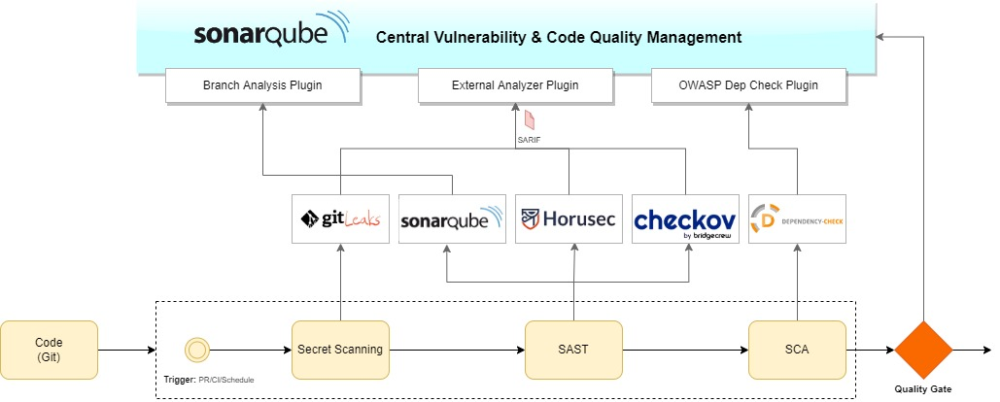

# Overview
This repository builds and publishes Docker image of SonarQube with a number of useful plugins pre-installed. A set of IaC templates have been provided to easily spinup SonarQube environments in corresponding cloud providers.  
This docker container comes with multiple plugins pre-packaged to integrate a number of external tools as illustrated in the below diagram.  


## List of supported plugins
- [SonarQube Community Branch Plugin](https://github.com/mc1arke/sonarqube-community-branch-plugin)
- [SonarQube Dependency-Check Plugin](https://github.com/dependency-check/dependency-check-sonar-plugin)
- [SonarQube plugin for Swift / Objective-C](https://github.com/insideapp-oss/sonar-apple)
- [SonarQube External Analyzer Plugin](https://github.com/amalabey/sonar-external-analyzer)

# Build Container Image
Follow the below steps to build a container.
```sh
docker build -t amalabey/sonarqube-supercharged:latest .
```
You can also use the pre-built images from the [this](https://hub.docker.com/repository/docker/amalabey/sonarqube-supercharged) repository in docker-hub.  

# Run Container on Local Machine
Follow the below steps to run the image built in the step above.
```sh
docker run -d -p 9000:9000 --name sc amalabey/sonarqube-supercharged:latest
```
You can access the portal on [http://localhost:9000](http://localhost:9000). Use `admin`/`admin` as username/password to login. You will be prompted to change the password on first login.

# Deploy to Azure
Currently, Infrastructure-as-Code (IaC) templates are available only for Azure. You can also tweak the service sizes and tiers in the provided Bicep template.
```sh
cd azure
az deployment group create -g <your-resource-group> --template-file .\main.bicep  --parameters dbAdminPassword=<your-db-password> solutionName=sonarqube-sc envPrefix=prod
```
You will need to change the default admin password at the first login. The default credentials are admin/admin.

# Getting Started
Refer to the sample project: [amalabey/security-integration-demo](https://github.com/amalabey/security-integration-demo/) on how to get started using this SonarQube environment.